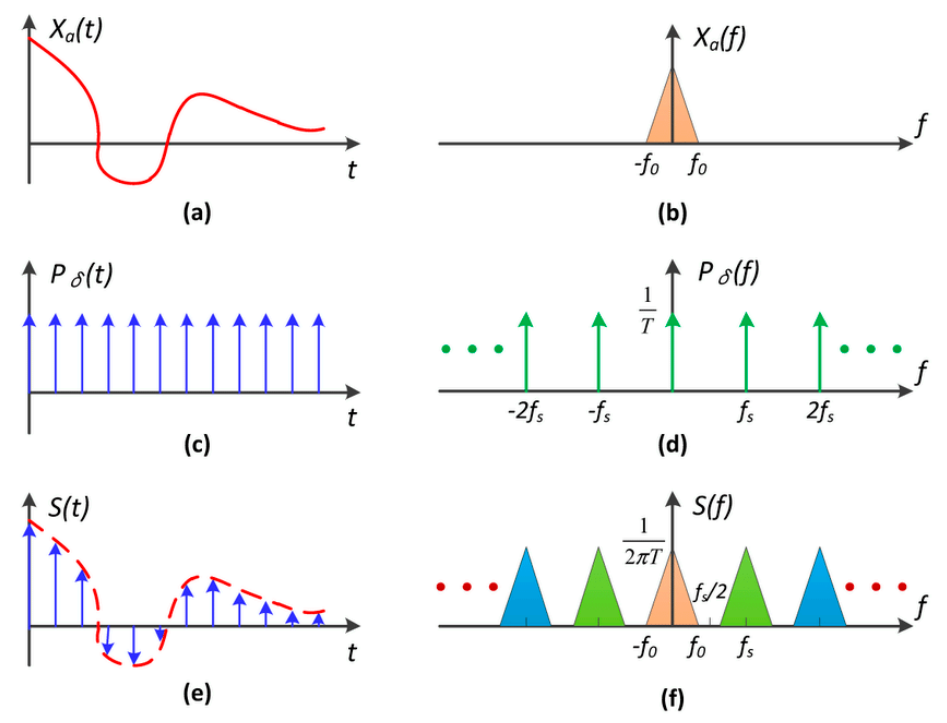

# 计算机图形学入门

[toc]

## 计算机图形学概述 Overview of Computer Graphics

### 计算机图形学是什么

计算机图形学是利用计算机来合成操作虚拟信息的技术。

The use of computers to synthesize and manipulate visual information.

### 为什么要学习计算机图形学

#### 计算机图形学的应用

+ 游戏 Video Game
+ 电影 Movies
+ 动画 Animations
+ 设计 Design
+ 可视化 Visualization
+ 虚拟现实 Virtual Reality
+ 增强现实 Augmented Reality
+ 数字画作 Digital IIIustration
+ 仿真 Simulation
+ 图形用户接口 Graphical User Interfaces
+ 拓扑学 Typography

#### 计算机图形学的基础挑战

+ 创造一个真实的虚拟世界，并和它交互
+ 需要对理解物理世界的法则
+ 需要新的计算方法、显示方式

#### 计算机图形学的技术挑战

+ 用数学语言来描述现实世界，比如曲线、曲面等
+ 光照和阴影的物理法则
+ 将图形在3D中重现并变换操作
+ 动画，仿真

### 课程内容

#### 光栅化 Rasterization

+ 将几何基元投影到屏幕上
+ 把投影基元转换为像素
+ 实时渲染，即至少30fps

#### 曲线和曲面 Curves and Meshes

+ 如何在计算机中表示几何图形

#### 光线追踪 Ray Tracing

+ 把光线从相机打到每个像素
  + 计算其相交和阴影
  + 持续计算直到光线接触到光源

#### 动画仿真 Animation/Simulation

+ 动画关键帧
+ 质量-弹簧系统

## 变换 Transformation

### 二维变换

#### 缩放 Scale


缩放变换可以用如下方程表示
$$
{x}' = sx
\\
y' = sy
$$

可用矩阵表示为

$$
\begin{bmatrix}  
  x' \\
  y'
\end{bmatrix} =  
\begin{bmatrix}  
  s & 0 \\
  0 & s
\end{bmatrix}
\begin{bmatrix}  
  x \\
  y
\end{bmatrix}
$$


上图所示的缩放变换可以用如下方式表示
$$
\begin{bmatrix}  
  x' \\
  y'
\end{bmatrix} =  
\begin{bmatrix}  
  s_x & 0 \\
  0 & s_y
\end{bmatrix}
\begin{bmatrix}  
  x \\
  y
\end{bmatrix}
$$

#### 翻转 Reflection


$$
\begin{bmatrix}  
  x' \\
  y'
\end{bmatrix} =  
\begin{bmatrix}  
  -1 & 0 \\
  0 & 1
\end{bmatrix}
\begin{bmatrix}  
  x \\
  y
\end{bmatrix}
$$

#### 错切 Shear


在竖直方向上，变换前后的y值没有变化。

在水平方向上，在最底下边的x值没有变化，沿y轴越往上x值就会增加ay。
$$
\begin{bmatrix}  
  x' \\
  y'
\end{bmatrix} =  
\begin{bmatrix}  
  1 & a \\
  0 & 1
\end{bmatrix}
\begin{bmatrix}  
  x \\
  y
\end{bmatrix}
$$

#### 旋转 Rotate


正向旋转矩阵如下所示。
$$
R_{\theta} =
\begin{bmatrix}
\cos{\theta} & -\sin{\theta} \\
\sin{\theta} & \cos{\theta}
\end{bmatrix}
$$

逆向旋转矩阵如下所示。

$$
R_{-\theta} =
\begin{bmatrix}
\cos{\theta} & \sin{\theta} \\
-\sin{\theta} & \cos{\theta}
\end{bmatrix}
$$

观察上面两个矩阵可以知道
$$
R_{-\theta} = {R_{\theta}}^T
$$
又根据定义可知
$$
R_{-\theta} = {R_{\theta}}^{-1}
$$
综上
$$
R_{-\theta} = {R_{\theta}}^{-1} = {R_{\theta}}^T
$$

#### 线性变换 Linear Transforms

$$
x' = ax + by \\
y' = cx + dy
$$

$$
\begin{bmatrix}  
  x' \\
  y'
\end{bmatrix} =  
\begin{bmatrix}  
  a & b \\
  c & d
\end{bmatrix}
\begin{bmatrix}  
  x \\
  y
\end{bmatrix}
$$

$$
\mathbf{x}' = \mathbf{M}\  \mathbf{x}
$$

### 齐次坐标 Homogeneous Coordinate

#### 为什么要引入齐次坐标


$$
x' = x + t_x \\
y' = y + t_y
$$

$$
\begin{bmatrix}  
  x' \\
  y'
\end{bmatrix} =  
\begin{bmatrix}  
  a & b \\
  c & d
\end{bmatrix}
\begin{bmatrix}  
  x \\
  y
\end{bmatrix}
+
\begin{bmatrix}  
  t_x \\
  t_y
\end{bmatrix}
$$

可以发现，在平移变换中，无法将其用一个矩阵表示。这是因为平移变化并不是一种线性变换。

为了将所有变化统一使用一个矩阵表示，由此引入齐次坐标。

#### 齐次坐标系

在xy轴的基础上，再引入第三个维度（w维度），就得到齐次坐标系。

+ 2D点	$(x,y,1)^T$
+ 2D向量$(x,y,0)^T$

为什么要在最后增加一个0或者1，它们有什么意义？

+ 向量 + 向量 = 向量 （0+0 = 0）
+ 点 - 点 = 向量 （1-1 = 0）
+ 点 + 向量 = 点 （1+0 = 1）
+ 点 + 点 = ？

在齐次坐标系中
$$
\begin{pmatrix} x \\ y \\ w \end{pmatrix} = \begin{pmatrix} x/w \\ y/w \\ 1 \end{pmatrix} , w \ne 0
$$

#### 仿射变换 Affine Transformations

仿射变换 = 线性变换 + 平移变换

$$
\begin{pmatrix} 
x' \\
y'
\end{pmatrix}=
\begin{pmatrix} 
a & b \\
c & d
\end{pmatrix}
\begin{pmatrix} 
x \\
y
\end{pmatrix}
+
\begin{pmatrix} 
t_x \\
t_y
\end{pmatrix}
$$

使用齐次坐标系后，上式可以写作

$$
\begin{pmatrix} 
x' \\
y' \\
1
\end{pmatrix} =
\begin{pmatrix} 
a & b & t_x\\
c & d & t_y\\
0 & 0 & 1
\end{pmatrix}
\begin{pmatrix} 
x \\
y \\
1
\end{pmatrix}
$$

#### 缩放变换

$$
\mathbf{S}(s_x,s_y) = 
\begin{pmatrix} 
s_x & 0 & 0\\
0 & s_y & 0\\
0 & 0 & 1
\end{pmatrix}
$$

#### 旋转变换

$$
\mathbf{R}(\alpha) = 
\begin{pmatrix} 
\cos{\alpha} & -\sin{\alpha} & 0\\
\sin{\alpha} & \cos{\alpha} & 0\\
0 & 0 & 1
\end{pmatrix}
$$

#### 平移变换

$$
\mathbf{T}(t_x, t_y) = 
\begin{pmatrix} 
1 & 0 & t_x\\
0 & 1 & t_y\\
0 & 0 & 1
\end{pmatrix}
$$

### 逆变换 Inverse Transform

$\mathbf{M}^{-1}$就是变换$\mathbf{M}$的逆变换。


### 复合变换 Composite Transform


复杂的变换可以通过多个简单变换组合而成，复杂变换的矩阵就是多个简单变换矩阵的乘法，但是要注意**矩阵相乘的次序**。

先平移后旋转


$$
R_{45} \cdot T_{(1,0)}
\begin{bmatrix}
x \\
y \\
1
\end{bmatrix} =
\begin{bmatrix}
1 & 0 & 1 \\
0 & 1 & 0 \\
0 & 0 & 1
\end{bmatrix}
\begin{bmatrix}
\cos{45^{\circ}} & -\sin{45^{\circ}} & 1 \\
\sin{45^{\circ}} & \cos{45^{\circ}} & 0 \\
0 & 0 & 1
\end{bmatrix}
\begin{bmatrix}
x \\
y \\
1
\end{bmatrix}
$$


先旋转后平移


$$
T_{(1,0)} \cdot R_{45}
\begin{bmatrix}
x \\
y \\
1
\end{bmatrix} =
\begin{bmatrix}
\cos{45^{\circ}} & -\sin{45^{\circ}} & 1 \\
\sin{45^{\circ}} & \cos{45^{\circ}} & 0 \\
0 & 0 & 1
\end{bmatrix}
\begin{bmatrix}
1 & 0 & 1 \\
0 & 1 & 0 \\
0 & 0 & 1
\end{bmatrix}
\begin{bmatrix}
x \\
y \\
1
\end{bmatrix}
$$

对同一个图像应用多个简单仿射变换，$\mathbf{A}_1,\mathbf{A}_2,...,\mathbf{A}_n$
$$
\mathbf{A}_n \cdots \mathbf{A}_2 \mathbf{A}_1 \cdot \mathbf{x}
$$

### 分解复杂变换 Decomposing Complex Transforms


$$
\mathbf{T}(c) \cdot \mathbf{R}(\alpha) \cdot \mathbf{T}(-c)
$$

### 三维变换 

#### 三维下的齐次坐标系

类比于二维坐标下的齐次坐标系，在xyz轴的基础上，再引入第三个维度（w维度），就得到齐次坐标系。

+ 3D点	$(x,y,z,1)^T$
+ 3D向量$(x,y,z,0)^T$

$$
\begin{pmatrix}
x \\
y \\ 
z \\ 
w 
\end{pmatrix} = 
\begin{pmatrix} 
x/w \\ 
y/w \\ 
z/w \\
1 
\end{pmatrix} , w \ne 0
$$

#### 仿射变换

$$
\begin{pmatrix}
x' \\
y' \\ 
\end{pmatrix} = 
\begin{pmatrix} 
a & b & c\\ 
d & e & f\\ 
g & h & i\\
\end{pmatrix}
\cdot
\begin{pmatrix}
x \\
y \\ 
z \\ 
\end{pmatrix}
+
\begin{pmatrix}
t_x \\
t_y \\ 
t_z \\ 
\end{pmatrix}
$$


$$
\begin{pmatrix}
x' \\
y' \\ 
z' \\ 
1 
\end{pmatrix} = 
\begin{pmatrix} 
a & b & c & t_x \\ 
d & e & f & t_y \\ 
g & h & i & t_z \\
0 & 0 & 0 & 1 
\end{pmatrix}
\cdot
\begin{pmatrix}
x \\
y \\ 
z \\ 
1
\end{pmatrix}
$$

注意仿射变换中是先应用线性变换，然后应用平移变换。

#### 缩放变换

$$
\mathbf{S}(s_x,s_y,s_z) = 
\begin{pmatrix} 
s_x & 0 & 0 & 0\\
0 & s_y & 0 & 0\\
0 & 0 & s_z & 0 \\
0 & 0 & 0 & 1
\end{pmatrix}
$$

#### 平移变换

$$
\mathbf{T}(t_x, t_y, t_z) = 
\begin{pmatrix} 
1 & 0 & 0 & t_x\\
0 & 1 & 0 & t_y\\
0 & 0 & 1 & t_z\\
0 & 0 & 0 & 1
\end{pmatrix}
$$

#### 旋转变换

绕x轴旋转
$$
\mathbf{R}_x(\alpha) = 
\begin{pmatrix} 
1 & 0 & 0 & 0\\
0 & \cos{\alpha} & -\sin{\alpha} & 0\\
0 & \sin{\alpha} & \cos{\alpha} & 0\\
0 & 0 & 0 & 1
\end{pmatrix}
$$
绕y轴旋转
$$
\mathbf{R}_y(\alpha) = 
\begin{pmatrix} 
\cos{\alpha} & 0 & \sin{\alpha} & 0\\
0 & 1 & 0 & 0\\
-\sin{\alpha} & 0 & \cos{\alpha} & 0\\
0 & 0 & 0 & 1
\end{pmatrix}
$$
注意，在绕y轴旋转中，$\sin{\alpha}$和$-\sin{\alpha}$的位置交换，这是因为$\hat{z} \times \hat{x} = \hat{y}$，y轴方向上的旋转和其他两个轴方向相反。

绕z轴旋转
$$
\mathbf{R}_z(\alpha) = 
\begin{pmatrix} 
\cos{\alpha} & -\sin{\alpha} & 0 & 0\\
\sin{\alpha} & \cos{\alpha} & 0 & 0\\
0 & 0 & 1 & 0\\
0 & 0 & 0 & 1
\end{pmatrix}
$$
把三种旋转矩阵相乘即可得到任意旋转矩阵，如下所示
$$
\mathbf{R}_{xyz}(\alpha, \beta, \gamma) =
\mathbf{R}_x(\alpha)
\mathbf{R}_y(\beta)
\mathbf{R}_z(\gamma)
$$
上面所示的三个角度也称为欧拉角(Euler Angles)。

罗德里戈旋转公式 Rodrigues' Rotation Formula
$$
\mathbf{R}(\mathbf{n}, \alpha) = 
\cos{\alpha}\  \mathbf{I} +
(1-\cos{\alpha})\mathbf{n}\mathbf{n}^T +
\sin{\alpha} 
\mathbf{R}_z(\alpha) = 
\begin{pmatrix} 
0 & -n_z & n_y\\
n_z & 0 & -n_x\\
-n_y & n_x & 0
\end{pmatrix}
$$

### 观测变换 Viewing transformation

想象以下如何拍一张照片：

1. 把目标物摆好(**model** transformation)
2. 把相机摆好(**view** transformation)
3. 拍照(**projection** transformation)

#### 模型变换 Model Transformation

借助上面的变换方式把所有模型摆放在正确的位置上.

#### 视图变换 View/Camera Transformation


如何确定相机？

+ 位置 Position $\vec{e}$
+ 朝向 Look-at direction $\hat{g}$
+ 垂直方向 Up direction $\hat{t}$


做如下约定：

+ 相机永远放在坐标原点，y轴作为垂直方向，-z轴作为朝向
+ 随着相机移动变换对象


如何把相机固定到上述约定的位置：

+ 把$\vec{e}$移到原点
+ 把$\hat{g}$旋转到$-Z$
+ 把$\hat{t}$旋转到$Y$
+ 在完成上述两个旋转的同时，剩下的一个坐标轴$\hat{g} \times \hat{t}$也完成到$X$的旋转

用数学表示上述过程，用$M_{view}$记作变化矩阵。
$$
M_{view} = R_{view} T_{view}
$$

$$
T_{view} =
\begin{bmatrix}
1 & 0 & 0 & -x_e \\
0 & 1 & 0 & -y_e \\
0 & 0 & 1 & -z_e \\
0 & 0 & 0 & 1
\end{bmatrix}
$$

由于两个旋转不好求，可以求$\hat{g} \times \hat{t}$到$X$的旋转矩阵，这个就是旋转矩阵的逆矩阵。

$$
R_{view}^{-1} =
\begin{bmatrix}
x_{\hat{g} \times \hat{t}} & x_{t} & x_{-g} & 0 \\
y_{\hat{g} \times \hat{t}} & y_{t} & y_{-g} & 0 \\
z_{\hat{g} \times \hat{t}} & z_{t} & z_{-g} & 0 \\
0 & 0 & 0 & 1
\end{bmatrix}
$$

$$
R_{view} =
\begin{bmatrix}
x_{\hat{g} \times \hat{t}} & y_{\hat{g} \times \hat{t}} & z_{\hat{g} \times \hat{t}} & 0 \\
x_{t} & y_{t} & z_{t} & 0 \\
x_{-g} & y_{-g} & z_{-g} & 0 \\
0 & 0 & 0 & 1
\end{bmatrix}
$$

#### 投影变换 Projection Transformation

投影变换可以分为两种:

+ 正交投影 Orthographic projection
+ 透视投影 Perspective projection


透视投影有近大远小的性质,而正交投影没有.


正交投影认为相机无限远,而透视投影遵循透视法则.

##### 正交投影 Orthographic Projection


例如把立方体映射到正则立方体$[-1,1]^3$

1. 先做平移
2. 再做缩放

用数学公式描述上述过程可得
$$
M_{ortho} = 
\begin{bmatrix}
\frac{2}{r-l} & 0 & 0 & 0\\
0 & \frac{2}{t-b} & 0 & 0\\
0 & 0 & \frac{2}{n-f} & 0\\
0 & 0 & 0 & 1
\end{bmatrix}
\begin{bmatrix}
1 & 0 & 0 & -\frac{r+l}{2}\\
0 & 1 & 0 & -\frac{t+b}{2}\\
0 & 0 & 1 & -\frac{n+f}{2}\\
0 & 0 & 0 & 1
\end{bmatrix}
$$
注意在本课程中由于使用右手系,所以"近处"n是大于"远处"f的.

##### 透视投影 Perspective Project


如何做透视投影:

1. 把Frustum变换成Cuboid,使用$M_{persp \to ortho}$
2. 再做一次正交投影,使用$M_{ortho}$


由相似三角形得
$$
y'=\frac{n}{z}y
$$
同理可得
$$
x' = \frac{n}{z}x
$$
我们的目标是让
$$
\begin{pmatrix}
x\\
y\\
z\\
1
\end{pmatrix}
\Rightarrow
\begin{pmatrix}
nx/z\\
ny/z\\
unknown\\
1
\end{pmatrix} ==
\begin{pmatrix}
nx\\
ny\\
still\ unknown\\
z
\end{pmatrix}
$$
即需要一个矩阵让上式成立
$$
M_{persp \to ortho}^{(4\times 4)}
\begin{pmatrix}
x\\
y\\
z\\
1
\end{pmatrix} =
\begin{pmatrix}
nx\\
ny\\
unknown\\
z
\end{pmatrix}
$$
可以解得
$$
M_{persp \to ortho} =
\begin{pmatrix}
n & 0 & 0 & 0\\
0 & n & 0 & 0\\
? & ? & ? & ?\\
0 & 0 & 0 & 1
\end{pmatrix}
$$
又因为在任何一个平行xoy平面的平面的z值不变,可以得
$$
M_{persp \to ortho} =
\begin{pmatrix}
n & 0 & 0 & 0\\
0 & n & 0 & 0\\
0 & 0 & n+f & -nf\\
0 & 0 & 0 & 1
\end{pmatrix}
\\
其中f为远平面z值,n为近平面z值
$$

$$
\begin{align*}
M_{persp} &= M_{ortho}M_{persp \to ortho}\\
&=\begin{bmatrix}
\frac{2}{r-l} & 0 & 0 & 0\\
0 & \frac{2}{t-b} & 0 & 0\\
0 & 0 & \frac{2}{n-f} & 0\\
0 & 0 & 0 & 1
\end{bmatrix}
\begin{bmatrix}
1 & 0 & 0 & -\frac{r+l}{2}\\
0 & 1 & 0 & -\frac{t+b}{2}\\
0 & 0 & 1 & -\frac{n+f}{2}\\
0 & 0 & 0 & 1
\end{bmatrix}
\begin{bmatrix}
n & 0 & 0 & 0\\
0 & n & 0 & 0\\
0 & 0 & n+f & -nf\\
0 & 0 & 0 & 1
\end{bmatrix}
\end{align*}
$$


如何定义一个视锥:

+ 长宽比 aspect ratio

+ 垂直可视角度 vertical field-of-view, fovY
+ 水平可视角度,可以由长宽比和垂直可视角度推出.

可视角度越大,透视投影的效果越明显.


## 光栅化 Rasterization

在经过model transformation, view transformation, projection transformation之后,我们会得到一个$[-1,1]^3$的标准立方体,接下来就是把这个标准立方体投射到屏幕之上.

屏幕是什么?

+ 一堆像素点
+ 分辨率, e.g. 720p
+ 光栅成像设备

光栅化就是把东西画到屏幕上的过程.


有关像素和屏幕的定义:

+ 像素的坐标从(0, 0)到(width - 1, heigth - 1)
+ 像素(x, y)中心的坐标为(x + 0.5, y + 0.5)
+ 整个屏幕覆盖(0, 0)到(width, height)


把标准立方体变换到屏幕:

+ 忽视z方向
+ 把xy平面变换到屏幕大小: $[-1,1]^2 \to [0, width] \times [0, height]$

变换矩阵为
$$
M_{viewport}=
\begin{pmatrix}
\frac{width}{2} & 0 & 0 & \frac{width}{2}\\
0 & \frac{height}{2} & 0 & \frac{height}{2}\\
0 & 0 & 1 & 0\\
0 & 0 & 0 & 1
\end{pmatrix}
$$
上述变换称为视口变换.

### 三角形 基本形状单元 Triangles - Fundamental Shape Primitives

为什么三角形是基本形状单元?

+ 三角形是最简单的多边形
+ 其他的多边形都可以拆分成三角形
+ 三角形有特别的性质
  + 三角形一定是一个平面
  + 三角形的内外很好确定
  + 三角形重心插值方法明确

### 把三角形投射到屏幕的像素上


一个简单的方法就是采样离散化.


定义一个函数用来判断像素点是否在三角形内
$$
\mathbf{inside}(tri, x, y) =
\left \{
\begin{matrix}
1 & (x,y)\;in\;triangle\;t \\
0 & otherwise
\end{matrix}
\right .
$$

```c++
for (int x = 0; x < xmax; x++)
    for (int y = 0; y < ymax; y++)
        image[x][y] = inside(tri,
                            x + 0.5,
                            y + 0.5);
```

$\mathbf{inside}(tri, x, y)$函数的原理是利用向量的叉乘来判断点和三角形的位置关系.

判断$\Delta ABC$和$P$的位置关系:

如果$\vec{AB} \times \vec{AP}$,$\vec{BC} \times \vec{BP}$,$\vec{CA} \times \vec{CP}$方向相同,则$P$在$\Delta ABC$内部,否则$P$在$\Delta ABC$外部.


如果一个点在三角形的边上,可以不作考虑,或者特殊处理.


在计算哪些点在三角形内部时,不需要计算平面中的所有点,只需要计算将三角形包围起来的最小正方形区域即可.该区域被称为包围盒(Bouding Box).


在三角形比较特殊的情况下,可以利用上述方法来加速计算.

### 反走样 Antialiasing


我们希望得到的图像.


光栅化后得到的图像,存在锯齿(走样, aliasing).

采样(Sampling)会产生一系列的问题(Sampling Artifacts):

+ 锯齿(Jaggies)

  

+ 摩尔纹(Moiré Patterns)

  

+ 马车车轮错觉(Wagon Wheel Illusion), 人眼在时间上的采样跟不上物体运动速度

  

+ Many more

走样的原因: **信号变化速度太快(频率太高), 而采样速率太慢.**

#### 滤波 Pre-Filter


先模糊后采样


先采样后模糊,效果不对!

问题:

+ 为什么降采样会导致瑕疵?
+ 为什么先模糊(滤波)再采样能够反走样?

### 采样背后的信号原理

#### 傅里叶定理

已知傅里叶定理:任何一个连续函数都可以表示成多个正弦函数和余弦函数之和.


$$
f(x) = \frac{A}{2} + 
\frac{2A\cos{(t\omega)}}{\pi} - 
\frac{2A\cos{(3t\omega)}}{3\pi} + 
\frac{2A\cos{(5t\omega)}}{5\pi} + \cdots
$$
#### 傅里叶变换

由此可以延伸出傅里叶变换,把函数在时域和频域之间相互转化.


如果我们把一张图像看做时域函数,则将其经过傅里叶变换之后可以得到它的频域函数,如下所示.


频域图像中,中间部分代表低频信息,四周部分表示高频信息.

#### 滤波器

如果我们将频域图像通过一个高通滤波器,再得到的时域图像如下所示.由此可知**高频信息表示图像的边缘信息,即变化剧烈的地方**.(时域变化剧烈，也就是信号变化得快，变化快就是频率高，说明信号中包含了高频分量)


如果我们把频域图像通过一个低通滤波器,再得到的时域图像如下所示.可以发现只保留图像的低频信号相当于对图像进行模糊处理.


带通滤波器效果则如下图所示,它会去除图像的基本和边缘.


#### 卷积与滤波

在**频域上的滤波**,相当于在**频域上的卷积**.
$$
Fitering = Convolution
$$
时域上的卷积,等价于将图像和卷积核都变成频域后相乘的图像,如下所示.


卷积核越大,该卷积核所对应的低通滤波器所允许通过的频率越低,处理后的画面越模糊.如下两张图所示,第一张图所示的卷积核较小,其对应的低通滤波器能通过的信号频率较高.第二张图则相反.


#### 采样背后的信号原理

对时域信号进行采样时,在频域上是将该信号以采样周期进行延拓,如下图所示.



所以如果采样信号频率足够高,频域上的结果就不会混叠,所以不会产生走样.反之如果采样信号频率过低,频域上的结果就会混叠,进而造成走样.


> 为什么对信号进行时域采样,在频域上相当于对其做周期延拓?
>
> **频域周期延拓只是表面现象，其实质是不同的信号采样后的像可能相同，不可区分。**
>
> 
>
> 已知 ：
>
> (1) 1Hz的连续余弦信号x1(t)， 对其采样， 采样频率是 Fs = 10 Hz， 得到了1连串的数值x1[n] ;
>
> (2) 11Hz的连续余弦信号x2(t)， 对其采样， 采样频率是Fs = 10 Hz， 得到了1连串的数值x2[n] 
>
> 画出x1[n]和x2[n]的图像，比较它们的异同。
>
> ```matlab
> %% 用 Matlab 运行
> clc; close all;
> Fs = 10             % 采样频率 10 Hz
> Ti = 1.0/Fs         % 采样时间间隔
> t = 0:Ti:2          % 时间变量 2 秒
> 
> %% 信号 1
> f1 = 1  
> x1 = cos(2*pi*f1*t)
> figure(1)
> subplot(2,1,1)
> plot(t, x1,'-o') 
> legend('x1[n]')
> 
> %% 信号 2 绘图
> f2 = 11
> x2 = cos(2*pi*f2*t)
> figure(1)
> subplot(2,1,2)
> plot(t, x2, 'r-*') 
> legend('x2[n]')
> ```
>
> 你猜这两个信号绘出的时域图有什么区别?  答案是没有区别! 看图:
>
> 
>
> 
>
> 重要结论: **如果不同的两个连续信号 x1(t)、x2(t)的频率满足一定条件，用频率Fs采样，得到的离散的"像" x1[n]和x2[n]不可区分**。 换句话说:  通过对x1(t)的采样， 我们实际上同时得到了$x1(t)$, $x2(t)$, 甚至 $x3(t), \cdots, xn(t)$ 的采样的像。 它们的“像”是完全等价的, 不可区分。这一组信号 $x_n(t)$ 只需满足:
> $$
> x_n(t) = \cos{( n \cdot Fs + f_1)}
> $$
> 其中n 是整数,Fs 是采样频率。也就是说，任何信号的采样，它不仅表示它自己，它还表示一族信号。这一族信号就是该信号的周期延延。在数学上，这一族信号中**不同的信号间的间隔为n\*Fs。**

#### 如何减少采样造成的错误和瑕疵?

在学习了上述信号相关知识后,我们应该如何减少采样造成的错误和瑕疵?

+ 增加采样频率
+ 反走样
  + 将原信号在频域上进行裁切,比如让其通过一个低通滤波器进行滤波


如上图所示,经过低通滤波器后的原信号,即使使用更低频率的采样信号也不会发生走样.

#### 通过超分辨率来反走样的方法MSAA

MSAA通过将原生的1个像素看成n\*n个子像素的超分辨率方式来达到反走样的目的.比如对于下面的图像进行MSAA处理.


1. 将每个像素划分成更多的子像素,然后对所有子像素进行判断其是否在三角形内.

   

2. 将每个原生像素所对应的所有子像素取平均.

   

   

   

最后即可获得结果,如下图所示.


又比如对下图进行MSAA处理.


注意MSAA并非免费的,其会造成一定的性能开销,这取决于你确定的子像素个数.

其他的反走样方法还有:

+ 快速近似抗锯齿 FXAA
+ 时间性抗锯齿 TAA
+ ...

与反走样方法对应的还有超分辨率技术,比如:

+ 深度学习超分辨率 DLSS
+ ...


